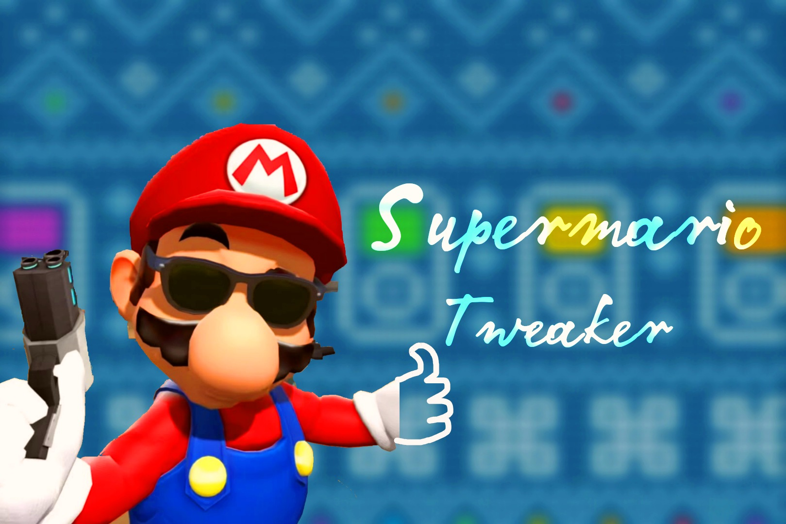

# 🍄 SuperMario Tweaker

**A system-level performance module for rooted Android — smoother UI, faster apps, smarter memory management.**

---

## 📖 Table of Contents

- [Overview](#-overview)
- [Features](#-features)
- [Installation](#-installation)
- [Requirements](#-requirements)
- [Compatibility](#️-compatibility)
- [FAQ](#-faq)
- [Reporting Issues](#-reporting-issues)
- [Contributing](#-contributing)
- [Disclaimer](#️-disclaimer)
- [Credits](#-credits)
- [Community](#-community)
- [Support the Project](#-support-the-project)

---

## 🚀 Overview

**SuperMario Tweaker** is a lightweight, root-level optimization module that tunes CPU scheduling, memory management, I/O, and UI rendering for a smoother, faster, and more responsive Android experience.

Rather than applying a fixed set of generic tweaks, the module detects your device's hardware and Android version at flash/boot time and applies only the optimizations that are safe and compatible — reducing the risk of instability compared to one-size-fits-all tweak scripts.

Built for daily use, not just benchmark screenshots.

**Compatible with:**

| Root Solution | Support |
|---|:---:|
| Magisk | ✅ |
| KernelSU | ✅ |
| APatch | ✅ |

---

## ✨ Features

| Category | What it does |
|---|---|
| 🚀 **Tweak Engine** | Fully rewritten core for better stability and lower overhead |
| ⚡ **App Launch Speed** | Faster cold/warm starts, reduced UI jank |
| 🎮 **Gaming Performance** | CPU/GPU scheduling tuned for sustained frame pacing |
| 🧠 **Memory Management** | Smarter RAM allocation and swap behavior |
| 📱 **UI Smoothness** | Reduced animation stutter and input latency |
| 🌐 **WebUI** | Display Engine to control screen saturation |
| 🖼 **Pixel Goodies** | Unlimited Google Photos Storage |
| 🔥 **CPU Scheduling** | Optimized governor and scheduler behavior |
| 🎯 **Background Processes** | Better control over background task priority |
| 💾 **Storage & Filesystem** | Tuned I/O scheduler and filesystem behavior |
| 🛡 **Logging** | Reduced unnecessary system logging overhead |
| 🔋 **Battery Efficiency** | Lower idle drain without sacrificing performance |
| 🧹 **Cache Cleaning** | Built-in utility for periodic cache maintenance |
| 🌐 **Online Updates** | In-module update checks and delivery |

---

## 📲 Installation

1. **Back up your device** (recommended for any system-level module — see [Disclaimer](#️-disclaimer)).
2. **Remove any conflicting tweak modules** — running SuperMario Tweaker alongside another performance module can cause conflicts.
3. **Download** the latest release from the [Releases page](https://github.com/mrx7014/SuperMario-Tweaker/releases/latest).
4. **Flash** the ZIP using your manager of choice:
   - Magisk → Modules → Install from storage
   - KernelSU → Modules → Install
   - APatch → Modules → Install
5. **Reboot** your device.
6. Done — enjoy a faster, smoother Android experience.

> 💡 **Tip:** If something feels off after flashing, disable the module from your manager and reboot before filing a report — this quickly rules out conflicts with other mods.

---

## 📋 Requirements

- Android 10 or newer
- Root access via Magisk, KernelSU, or APatch
- Unlocked bootloader with root already configured

---

## ⚙️ Compatibility

| Android Version | Status |
|---|:---:|
| Android 10 | ✅ |
| Android 11 | ✅ |
| Android 12 | ✅ |
| Android 13 | ✅ |
| Android 14 | ✅ |
| Android 15 | ✅ |
| Android 16 | ✅ |

> Optimizations are applied conditionally based on detected hardware and Android version. If a tweak isn't compatible with your setup, it's skipped rather than force-applied.

---

## ❓ FAQ

<b>Does it work on every device?</b>
 

It's designed to work broadly across Android devices by auto-detecting hardware and only applying compatible optimizations. Heavily customized OEM skins or non-standard kernels may see more limited gains than AOSP-based ROMs.

<b>Can I use it with another tweaking module?</b>
 

Not recommended. Running multiple tweak modules at once can cause conflicting overrides and unpredictable behavior. Stick to one at a time.

<b>Is it safe?</b>
 

Every tweak is selected for daily-driver stability, not just benchmark numbers. That said, as with any system-level module, we recommend keeping a recovery backup (TWRP/OrangeFox) before flashing.

<b>How do I uninstall it?</b>
 

Remove the module from your Magisk/KernelSU/APatch manager and reboot. No manual cleanup required.

<b>Will it trip SafetyNet / Play Integrity?</b>
 

The module itself only touches performance-related system parameters. If you're already passing integrity checks with your current root setup, SuperMario Tweaker shouldn't change that.

<b>I found a bug or my device behaves oddly — what do I do?</b>
 

See [Reporting Issues](#-reporting-issues) below.

---

## 🐛 Reporting Issues

Open a [GitHub Issue](https://github.com/mrx7014/SuperMario-Tweaker/issues/new) and include:

- Device model and chipset
- Android version and ROM (stock/custom)
- Root manager and version (Magisk/KernelSU/APatch)
- SuperMario Tweaker version
- Steps to reproduce, and logs if available (`dmesg`, logcat, or module log)

Reports without this info are much harder to act on — the more detail, the faster a fix.

---

## 🤝 Contributing

Contributions, fixes, and device-specific tweak profiles are welcome.

1. Fork the repository
2. Create a feature branch (`git checkout -b feature/my-tweak`)
3. Commit your changes with a clear message
4. Open a Pull Request describing what changed and why

If you're proposing a new tweak, please include the device(s) you tested it on.

---

## ⚠️ Disclaimer

This module modifies system-level behavior on a rooted device. While every tweak is tested for daily-driver stability:

- Flashing any system module carries inherent risk.
- Keep a **recovery backup** (TWRP/OrangeFox) before installing.
- The maintainers are not responsible for bootloops, data loss, or bricked devices resulting from misuse or incompatible configurations.
- Use at your own risk, and always test after major Android/ROM updates.

---

## ❤️ Credits

Developed by **[MRX7014](https://github.com/mrx7014)**

**Special thanks**
- [**@ZG089**](https://github.com/ZG089) — development and fixes
- All testers who helped shape this release ❤️

---

## 📢 Community

Join the Telegram channel for updates, support, and discussion:

**[t.me/mrxsspace](https://t.me/mrxsspace)**

---

## ⭐ Support the Project

If **SuperMario Tweaker** improved your device's performance, consider starring the repository — it helps others discover the project and supports future development.

🍄 **Thanks for using SuperMario Tweaker!**

