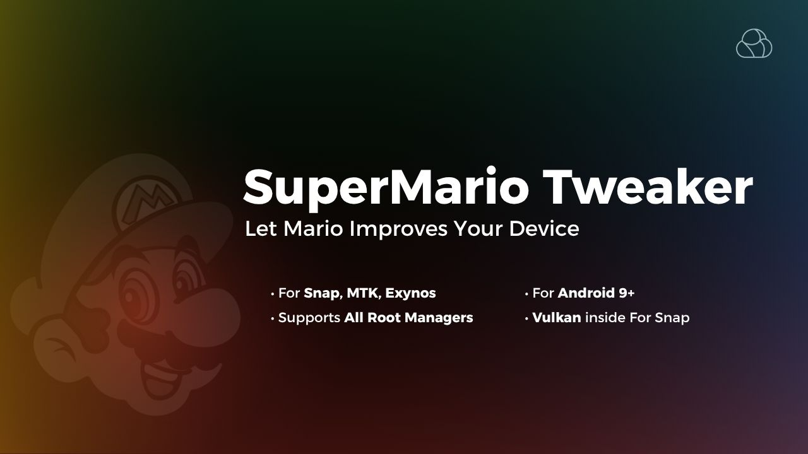

# SuperMario Tweaker

  
   

  
**Boost your Android device's performance, battery life, and gaming experience with SuperMario Tweaker!**
  
   
  
**Working on Snapdragon, Exynos, and MediaTek (Check Branches)**
  

---

## 🚀 Features

- **Faster boot times** & reduced startup lag  
- **Improved touch response** & smoother UI  
- **Stable FPS** for enhanced gaming performance  
- **Vulkan 1.4 support** (via Mesa Turnip v25.1.3) for better graphics  
- **Optimized RAM management** & faster app switching  
- **Battery life improvements** with deep Doze & background control  
- **CPU & GPU optimizations** for high performance    
- **Signature spoofing**  
- **Disabled Google bloatware** & unnecessary logging    
- **SurfaceFlinger & HWUI tweaks** for better UI rendering  
- **Dynamic CPU-GPU composition** for smoother multitasking  
- **Optimized app launch** & faster response with IORAPD prefetching  
- **Enhanced gaming experience** with CPU frequency locking & video mode optimizations

---

## ⚙️ Installation

1. Uninstall any conflicting modules (e.g., old DT Module).  
2. Flash the module via Magisk, KernelSU, or APatch.  
3. Reboot your device.  
4. Enjoy improved performance and stability!

---

## 📌 System Requirements

- Android 9 or higher (Recommended: Android 13–14 For Vulkan)  
- Adreno 600/700 series GPU (for Vulkan Turnip support)
- Compatible with Magisk / KernelSU / APatch  

---

## 🎮 Vulkan 1.4 Compatibility (Mesa Turnip)

> **Note:** Performance may vary depending on your SoC and kernel.

| Name                                            | Status | Notes                                                                                                                     |
|-------------------------------------------------|--------|---------------------------------------------------------------------------------------------------------------------------|
| 3D Mark                                         | ✅     |                                                                                                                           |
| GRID™ Autosport                                 | ✅     | Working.(60fps)                                                          |
| SpongeBob SquarePants Battle For Bikini Bottom  | ✅     | Working,Poor Performance.(20-30fps)                                      |
| Carx Street                                     | ✅     | Working,Poor Performance.(25-30fps)                                      |
| Dolphin Emulator                                | ✅     | Working.                                                                 |
| PPSSPP                                          | ✅     | Working.                                                                 |
| EggNS                                           | ✅     | Working.                                                                 |
| ANGLE (com.android.angle)                       | ✅     |                                                                                                                           |
| GTA Triology-Definitive Edition                 | ✅     | Working,Poor Performance.                                                   |
| Call of Duty WarZone Mobile                     | ✅     | Working,Texture Bugs,Poor Performance.                                    |
| Hitman Blood Money : Reprisal                   | ✅     | Working, 60 fps Medium Graphics.                                        |

---

## ❓ FAQ

**Q:** Will this work on all Android versions?  
**A:** Yes, But Android 9+ is recommended. (Android 13–14 (SDK 33/34) is recommended for full Vulkan 1.4 support.)

**Q:** Do I need a specific GPU?  
**A:** Vulkan 1.4 requires Adreno 6xx or 7xx GPUs. Other devices can still benefit from the general tweaks.

**Q:** Can I use this with other tweak modules?  
**A:** Not recommended. Conflicts may happen, especially with DT Modules or anything that modifies props or thermal settings.

**Q:** How do I uninstall it?  
**A:** Simply remove it via your Magisk/KSU manager and reboot.

---

## 🧑‍💻 Credits

**Developed & maintained by:** MRX7014

**Special thanks to**: 

**[@ZG089](https://github.com/ZG089) For His Development and Fixes**

**[@LaFlame](https://t.me/@LaFlameA1) For His Tweaks For Snapdragon Version**

**[@Omar](https://t.me/@helicopterr_helicopterr) For His Tweaks For MediaTek Verison**

**And All Testers**

---

For updates and support, join our Telegram channel: **[@MRX7014Cloud](https://t.me/MRX7014Cloud)**
