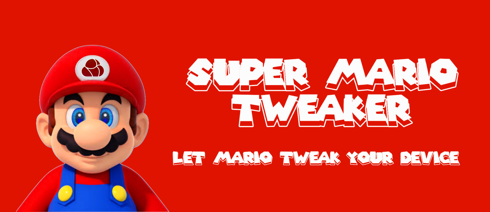

# SuperMario Tweaker v2.0.0

  
    
  

    
    
    
    
    
    
  

  
  <b>Boost your Android device's performance, battery life, and gaming experience with SuperMario Tweaker!</b>
  
   
  
<b>Working on Snapdragon only</b>
  

---

## 🚀 Features

- **Faster boot times** & reduced startup lag  
- **Improved touch response** & smoother UI  
- **Stable FPS** for enhanced gaming performance  
- **Vulkan 1.4 support** (via Mesa Turnip v25.0.3) for better graphics  
- **Optimized RAM management** & faster app switching  
- **Battery life improvements** with deep Doze & background control  
- **CPU & GPU optimizations** for high performance  
- **Game Mode** for boosted FPS and locked display to 120Hz  
- **Signature spoofing**  
- **Disabled Google bloatware** & unnecessary logging  
- **Thermal tuning** to prevent overheating during heavy use  
- **SurfaceFlinger & HWUI tweaks** for better UI rendering  
- **Dynamic CPU-GPU composition** for smoother multitasking  
- **Optimized app launch** & faster response with IORAPD prefetching  
- **Enhanced gaming experience** with CPU frequency locking & video mode optimizations  
- **Powerhint.xml Configurations** for optimized CPU & memory performance, with tuning for tasks like camera usage and video recording at different frame rates.  

---

## ⚙️ Installation

1. Uninstall any conflicting modules (e.g., old DT Module).  
2. Flash the module via Magisk, KernelSU, or APatch.  
3. Reboot your device.  
4. Enjoy improved performance and stability!

> **Note:** Root access is required. The module auto-applies tweaks at boot — no manual steps needed.

---

## 📌 System Requirements

- Android 10 or higher (Recommended: Android 13–14)  
- Adreno 600/700 series GPU (for Vulkan Turnip support)
- Compatible with Magisk / KernelSU / APatch  

---

## 🎮 Vulkan 1.4 Compatibility (Mesa Turnip)

> **Note:** Performance may vary depending on your SoC and kernel.

| Name                                            | Status | Notes                                                                                                                     |
|-------------------------------------------------|--------|---------------------------------------------------------------------------------------------------------------------------|
| 3D Mark                                         | ✅     |                                                                                                                           |
| GRID™ Autosport                                 | ✅     | Working.(60fps)                                                          |
| SpongeBob SquarePants Battle For Bikini Bottom  | ✅     | Working,Poor Performance.(20-30fps)                                      |
| Carx Street                                     | ✅     | Working,Poor Performance.(25-30fps)                                      |
| Dolphin Emulator                                | ✅     | Working.                                                                 |
| PPSSPP                                          | ✅     | Working.                                                                 |
| EggNS                                           | ✅     | Working.                                                                 |
| ANGLE (com.android.angle)                       | ✅     |                                                                                                                           |
| GTA Triology-Definitive Edition                 | ✅     | Working,Poor Performance.                                                   |
| Call of Duty WarZone Mobile                     | ✅     | Working,Texture Bugs,Poor Performance.                                    |
| Hitman Blood Money : Reprisal                   | ✅     | Working, 60 fps Medium Graphics.                                        |

---

## ❓ FAQ

**Q:** Will this work on all Android versions?  
**A:** Yes, but Android 13–14 (SDK 33/34) is recommended for full Vulkan 1.4 support.

**Q:** Do I need a specific GPU?  
**A:** Vulkan 1.4 requires Adreno 6xx or 7xx GPUs. Other devices can still benefit from the general tweaks.

**Q:** Can I use this with other tweak modules?  
**A:** Not recommended. Conflicts may happen, especially with DT Modules or anything that modifies props or thermal settings.

**Q:** How do I uninstall it?  
**A:** Simply remove it via your Magisk/KSU manager and reboot.

---

## 📊 Performance Comparison (Real-World Results)

| Scenario                     | Without Tweaks          | With SuperMario Tweaker v2.0.0 | Improvement               |
|------------------------------|--------------------------|-------------------------------|---------------------------|
| Boot Time                    | ~45–60 seconds           | ~25–30 seconds                | Up to 45% faster          |
| App Launch Time (Heavy Apps) | ~2.5–3.2 seconds          | ~1.2–1.8 seconds               | Faster app response       |
| Game FPS Stability (Medium)  | Noticeable fluctuations + heat | Stable FPS + lower temperature | Smoother and cooler gaming|
| RAM Usage (App Switching)    | Slows after 3–4 apps     | Smooth even with 6–7 apps      | Improved RAM management   |
| Battery Idle Drain           | ~3–4% per hour           | ~1–1.5% per hour              | Better battery standby    |
| UI Animation Smoothness      | Minor lag/stutter        | Smooth and fast animations     | Faster UI responsiveness  |

> **Note:** Results may changed depending on kernel, device, and ROM used.

---

## 🧑‍💻 Credits

**Developed & maintained by:** MRX7014

**Special thanks to:** Open-source Vulkan (Mesa Turnip) community and all testers  

For updates and support, join our Telegram channel: **[@MRX7014Cloud](https://t.me/MRX7014Cloud)**
